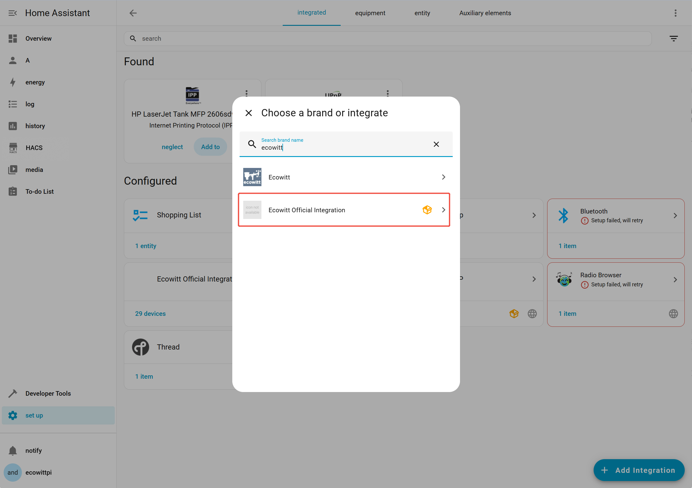
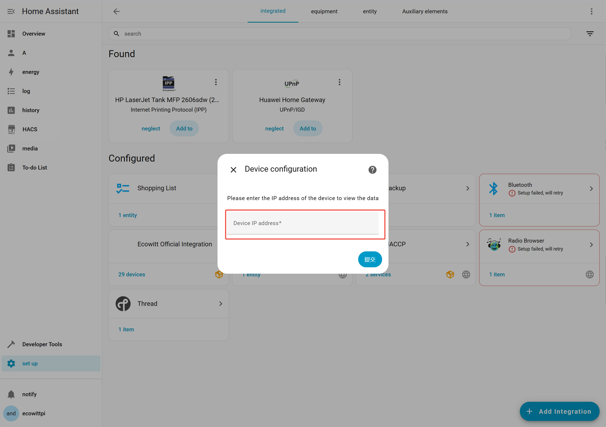
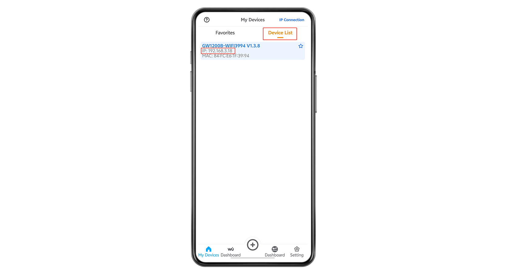
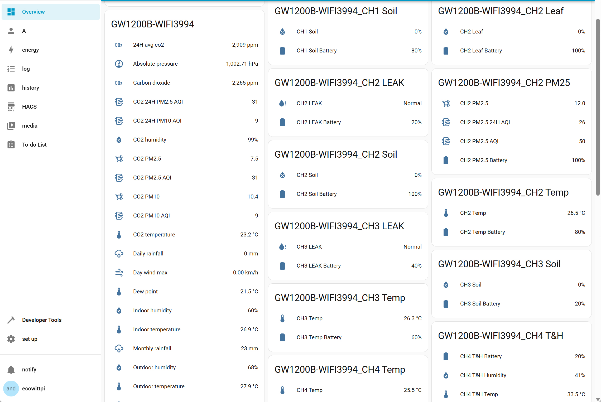

# Home Assistant - Ecowitt Official Integration
 

 
This integrated uses web interfaces to obtain data from the local network.

## :computer: Installation

### HACS (Preferred)
This integration can be added to Home Assistant as a [custom HACS repository](https://hacs.xyz/docs/faq/custom_repositories):
1. From the HACS page, click the 3 dots at the top right corner.
1. Select `Custom repositories`.
1. Add the URL `https://github.com/Ecowitt/ha-ecowitt-iot`
1. Select the category `Integration`.
1. Click the ADD button.
1. Restart Home Assistant
1. Click the button below, or in the HA UI go to "Configuration" -> "Integrations" click "+" and search for "Ecowitt Official Integration"

### Manual
1. Download the latest release from [here](https://github.com/Ecowitt/ha-ecowitt-iot/releases).
1. Create a folder called `custom_components` in the same directory as the Home Assistant `configuration.yaml`.
1. Extract the contents of the zip into folder called `ha_ecowitt_iot` inside `custom_components`.
1. Restart Home Assistant
1. Click the button below, or in the HA UI go to "Configuration" -> "Integrations" click "+" and search for "Ecowitt Official Integration"

## :bulb: Usage
Ecowitt Official Integration Compatibility Instructions:
| Ecowitt Official Integration        |  IoT device (developing)    |Model|
|:-----------:|:-----------:|:-----------|
| ×      | ×      |GW1000,WS6006,WN1900,WN1910,WS2320,WS2910,HP2550,HP3500,HP2560|
| ✓      | ×      |GW1100|
| ✓  | ✓  |GW1200,GW2000,GW3000,WS6210,WN1700,WN1820,WN1821,WN1920,WN1980,WS3800,WS3820,WS3900,WS3910|

HA Default Integration Compatibility Instructions: www.home-assistant.io/integrations/ecowitt/
| HA Default Integration   |  IoT device    |Model|
|:-----------:|:-----------:|:-----------|
| ✓      | ×      |GW1000,WS6006,WN1900,WN1910,WS2320,WS2910,HP2550,HP3500,HP2560,GW1100,GW1200,GW2000,GW3000,WS6210,WN1700,WN1820,WN1821,WN1920,WN1980,WS3800,WS3820,WS3900,WS3910|

To set up this integration, follow these steps:
1. Configure your gateway device on your LAN using the WSView Plus app or Ecowitt app on your phone.
2. Obtain the device's IP address through the web UI or WSView Plus app.
3. Enter the device's IP address in the integration. Upon successful connection, the integration will retrieve data from the gateway device.

